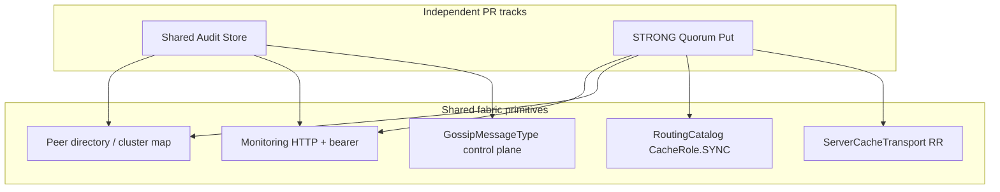
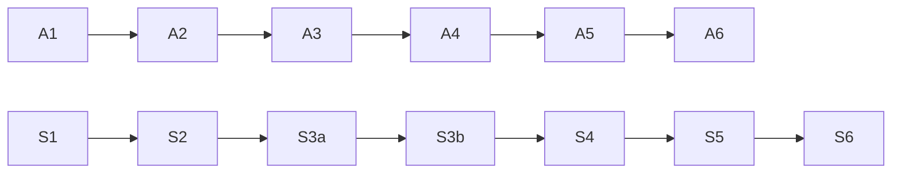

# Multi-Node Shared Audit Store & ConsistencyLevel.STRONG Product

| Field                         | Value                                                                                                                                                                                                                                                                                                                 |
| ----------------------------- | --------------------------------------------------------------------------------------------------------------------------------------------------------------------------------------------------------------------------------------------------------------------------------------------------------------------- |
| **Title**                     | Multi-Node Shared Audit Store & Cache ConsistencyLevel.STRONG                                                                                                                                                                                                                                                         |
| **Author**                    | MPREG Platform                                                                                                                                                                                                                                                                                                        |
| **Track owners**              | Track A (Shared Audit): Management plane / ops; Track S (STRONG): Cache data plane                                                                                                                                                                                                                                    |
| **Date**                      | 2026-08-05                                                                                                                                                                                                                                                                                                            |
| **Status**                    | **Shipped** (rev 3 design; Tracks A+S implemented; claims INV-SHARED-AUDIT-01 / INV-CACHE-STRONG-01)                                                                                                                                                                                                                  |
| **Tracks**                    | Independent PR DAGs (A = Shared Audit, S = STRONG); may ship in either order                                                                                                                                                                                                                                          |
| **Sequencing**                | **Complete** for v1 MVP + residual honesty track (live mesh, history, adversarial fail-closed). Remaining: REPL modes / full UI; STRONG get/delete v1.1; WAN/Jepsen/BFT/fsync stay non_claims.                                                                                                                          |
| **Related**                   | `docs/MANAGEMENT_UI_CLI_NEXT_STEPS.md`, `docs/CACHING_SYSTEM.md`, `docs/ARCHITECTURE.md`, `docs/SHARED_AUDIT_STRONG_RESIDUAL_HONESTY.md`, `tests/invariants/claims.yaml`                                                                                                                                              |
| **Mechanical conflict zones** | Both tracks touch `mpreg/core/config.py`, `mpreg/server.py` boot, `mpreg/examples/apps/_shared/features.py` + `registry.py`, and optionally monitoring metrics. No logical cross-deps, but parallel long-lived branches will conflict — prefer short-lived branches or sequential integration windows on those files. |

---

## Overview

> **Implementation status (2026-08):** Both tracks are **shipped** flag-gated products.
> Defaults remain off/fail-closed. Operator docs, curriculum apps, and claims ledger
> match the design below. Residual honesty (live same-host STRONG RR + peer-loss,
> live shared-audit multi-origin churn, bounded history checker, adversarial
> fail-closed) is documented in `docs/SHARED_AUDIT_STRONG_RESIDUAL_HONESTY.md` —
> still **not** WAN/BFT/fsync/Jepsen. Pre-ship “current state” tables in Background
> are historical.

Two product surfaces complete the management and cache honesty story for MPREG:

1. **Multi-node shared audit store** — process-local `MgmtAuditLog` remains the default;
   with `mgmt_audit_shared_enabled`, a cluster G-Set + watermarks replicates mutations
   so `GET /mgmt/v1/audit?scope=cluster` sees peers. Package: `mpreg/server_pkg/shared_audit/`.

2. **`ConsistencyLevel.STRONG` product** — with `cache_strong_enabled`, `GlobalCacheManager`
   majority-commit put via `StrongPutCoordinator` (`mpreg/core/cache_strong.py`). Flag off
   or unbound → `1012`. STRONG get/delete remain refuse. `location_consistency` stays fail-closed.

Both products reuse existing fabric primitives. Defaults remain fail-closed and single-node safe. Each track is a well-encapsulated, self-managing module with unit + multi-node integration + curriculum teach apps + claims ledger updates.

**v1 protocol decisions (locked — see Key Decisions):**

- Shared audit rides **control-plane gossip** via new `GossipMessageType` values (not a phantom plugin registry).
- Shared audit is a **bounded G-Set with per-origin retention watermarks** (not a true OR-set; no silent resurrection after eviction).
- STRONG uses a **commit-barrier** (majority **commit** ACKs before client success; **origin-commit-last**; failed puts **ABORT-uncommit** peer+origin L1 for `op_id`), via `CacheMessageKind` + `ServerCacheTransport` RR — not Raft value logs.
- Error codes: **1015–1018** operational; **1012** for disabled/not-implemented (including STRONG get/delete); **1013** remains `ROUTE_LOOP`.

---

## Background & Motivation

### Shared audit — current state (code facts)

| Surface          | Location                                                   | Behavior today                                                                                         |
| ---------------- | ---------------------------------------------------------- | ------------------------------------------------------------------------------------------------------ |
| Entry model      | `MgmtAuditEntry(event, timestamp, actor, success, detail)` | Frozen dataclass; `to_dict()`                                                                          |
| Store            | `MgmtAuditLog` in `mgmt_mutations.py`                      | `deque` + `RLock`; optional JSONL append/load                                                          |
| Boot             | `MPREGServer` ~L1858                                       | `MgmtAuditLog(persist_path=settings.mgmt_audit_path)`                                                  |
| Snapshot         | `_mgmt_audit_snapshot` → `mgmt_audit_provider`             | List of dicts                                                                                          |
| HTTP             | `FederationMonitoringSystem._get_mgmt_audit`               | Accepts provider `list` **or** `dict` with `mutations`/`entries`; plus local `RouteDecisionLog.recent` |
| CLI              | `mpreg admin audit`                                        | Warns if no `mgmt_audit_path`                                                                          |
| Settings         | `MPREGSettings.mgmt_audit_path`                            | Opt-in local durability only                                                                           |
| Curriculum       | `ops_cli_tour`, `live_partition_chaos`                     | Local JSONL only                                                                                       |
| Docs (post-ship) | Operator + curriculum surfaces                             | Updated: shared audit shipped; STRONG flag-gated; REPL/UI remain                                       |
| Gossip bus       | `GossipMessageType` in `gossip.py`                         | **Closed Enum** + `from_dict` switch — no plugin registry                                              |

Pain points:

- After drain on node A, querying node B’s `/mgmt/v1/audit` shows nothing for that mutation.
- Process restart without `mgmt_audit_path` loses the ring; with JSONL, only that node’s disk has history.
- Single-node loss (disk/VM) can erase the only copy of admin forensics.

### STRONG — current state (code facts)

| Surface           | Location                                    | Behavior today                                                                                                                                                                                   |
| ----------------- | ------------------------------------------- | ------------------------------------------------------------------------------------------------------------------------------------------------------------------------------------------------ |
| Enum              | `cache_models.ConsistencyLevel`             | `STRONG = "strong"` reserved; docstring fail-closed                                                                                                                                              |
| Duplicate enum    | `location_consistency.ConsistencyLevel`     | Separate Enum; COR-02 refuse on put **and** get                                                                                                                                                  |
| Put gate          | `GlobalCacheManager.put`                    | COR-01: refuse **before any local write** (also before namespace index side effects must be respected by coordinator)                                                                            |
| L3 path           | `_put_to_l3` → `propagate_cache_operation`  | Async queue; apply-local-then-gossip; no ACK barrier                                                                                                                                             |
| Replication queue | `_enqueue_replication`                      | Background; drop-oldest under pressure — **not** STRONG-safe                                                                                                                                     |
| Result type       | `CacheOperationResult` (`cache_models.py`)  | `success`, `error_message`, … — **no `error_code` or `quorum_info` fields today**                                                                                                                |
| Plane RPC         | `plane_rpc` cache put                       | String-matches `"STRONG"` / `"not implemented"` → always `error_code` **1012**                                                                                                                   |
| Errors            | `MpregErrorCode`                            | `UNSUPPORTED_CONSISTENCY = 1012`; **`ROUTE_LOOP = 1013`**; discovery **1101+**; catch-all **1099**. Free modality/cache band: **1014 unused, prefer 1015+** to leave 1014 free or use explicitly |
| Claims            | `claims.yaml` non_claims                    | Only: _“location_consistency.ConsistencyLevel.STRONG is not a production guarantee (fail-closed)”_ — **not** a GlobalCacheManager blanket non_claim                                              |
| Chaos             | `tests/chaos/test_t9_residuals.py`          | Asserts failed STRONG leaves no L1 residual (refuse path only)                                                                                                                                   |
| Raft              | `ProductionRaft` + apply waiters            | CFT log consensus; fabric raft transport exists                                                                                                                                                  |
| Peer selection    | `ServerCacheTransport.peer_ids`             | `CacheRole.SYNC` via routing index; `CachePeerSelector` + `CacheNodeProfile` for ranking                                                                                                         |
| Cache RR          | `CacheMessageKind` + `ServerCacheTransport` | `OPERATION`, `DIGEST_*`, `ENTRY_*` with correlation futures — **prior art for barrier RR**                                                                                                       |

Pain points:

- Callers who want majority durability have no supported API; only EVENTUAL/WEAK.
- Background replication drops under pressure — unsuitable for quorum semantics.
- Honesty banners everywhere must stay until a real barrier ships; then flip claims carefully.

---

## Goals & Non-Goals

### Product 1 — Shared audit

**Goals**

- Any node’s `GET /mgmt/v1/audit?scope=cluster` can return a **merged cluster view** of mgmt mutations (explicit scope; default stays local).
- Survive **single-node loss** (not only process restart via local JSONL), subject to retention watermarks.
- Opt-in via settings/feature flag; **default remains process-local + optional JSONL**.
- Self-managing: peer discovery from existing cluster map / peer directory; background reconcile; no ZooKeeper.
- Auth: existing monitoring bearer / mutation auth patterns (ERG-T10-04 / ERG-T11-03).
- Encapsulated package; xdist-safe tests; event-driven waits; curriculum teach app.
- Honest non-claims in API payloads and docs.

**Non-goals**

- Not a SIEM (no long-term retention tiers, no SIEM query language, no compliance export formats beyond JSONL/JSON).
- Not multi-tenant org partitioning / RBAC beyond current monitoring token model.
- Not BFT; not cross-cluster federation audit WAN mesh in v1 (same `cluster_id` only).
- Not replacing `RouteDecisionLog` with a shared store (route decisions stay local — **v1.1+ non-goal**, see Open Questions).
- Not requiring Raft for the audit value path in v1 (see Key Decisions).
- Not a true observed-remove OR-set with arbitrary deletes; v1 is **bounded grow-only with watermark compaction**.
- Not Raft-total-ordered audit (v1.1 compliance option only).

### Product 2 — STRONG

**Goals**

- Real **majority-commit barrier** for cache **put** (not prepare-only).
- **No residual committed write on origin** if quorum fails (COR-01). Peers drop
  prepare/commit-intent on **delivered** ABORT. ABORT is CFT best-effort: partial
  peer COMMIT + lost ABORT may leave peer L1 (documented limit; not BFT).
- Clear success guarantee text in API/docs/claims (see Semantics).
- Settings for quorum size / replica-set selection from cache-capable peers (`CacheRole.SYNC`).
- Metrics: quorum latency, ack counts, failures (minimal counters land with enablement).
- Curriculum app: success path + fail-closed insufficient-peers path.
- Update `claims.yaml` / honesty banners **only when product is real and tested**.

**Non-goals**

- Not linearizability across WAN / multi-region.
- Not BFT.
- Not STRONG **delete/invalidate** in v1 (refuse with structured code).
- Not STRONG **get** / quorum read in v1 MVP (remain refuse or local-only EVENTUAL get after put; quorum get is **v1.1**).
- Not full Raft log for every cache value.
- Not changing EVENTUAL/WEAK performance characteristics when STRONG is unused.
- Not durable-on-disk quorum (v1 = durable-in-memory on majority of replica set after **commit** ACK).
- Not implementing a second STRONG path on `location_consistency` (stays fail-closed; see Key Decisions).

---

## Proposed Design

### Architecture relationship



The two products share discovery and monitoring patterns but **must not** share a module or feature flag. Either can merge first. Expect mechanical conflicts on `config.py` / `server.py` / curriculum registries if both land in the same window.

---

# Part A — Multi-Node Shared Audit Store

## A.1 Design summary

Introduce a **bounded grow-only (G-Set) replicated audit set** with **per-origin retention watermarks**, gossiped among nodes in the same `cluster_id`, layered **on top of** the existing local `MgmtAuditLog` when shared mode is off the local path is unchanged.

```text
mpreg/server_pkg/shared_audit/
  __init__.py
  models.py          # SharedAuditRecord, watermark, envelope, schema_version
  store.py           # G-Set + watermark compaction + JSONL owner
  replicator.py      # gossip publish/consume + anti-entropy
  peer_view.py       # peer discovery from peer directory / cluster map
  response.py        # build_audit_response() single HTTP/CLI builder
  metrics.py         # counters for merge/replicate/persist
  settings.py        # dataclasses mirrored into MPREGSettings fields
```

Wire-in points (thin adapters only — no megaclass dumps into `server.py`):

| Hook     | File                                   | Change                                                                        |
| -------- | -------------------------------------- | ----------------------------------------------------------------------------- |
| Settings | `mpreg/core/config.py`                 | `mgmt_audit_shared: bool = False`, max entries, reconcile interval            |
| Boot     | `mpreg/server.py`                      | If shared: construct `SharedAuditReplicator`, hydrate store from JSONL        |
| Record   | `mgmt_mutations._audit`                | After local origin mirror `record()`, call `shared.publish(entry)` if enabled |
| Snapshot | provider callable                      | Delegates to `build_audit_response` / store snapshot — **not** dual builders  |
| HTTP     | `monitoring_endpoints._get_mgmt_audit` | Calls single builder; honors `scope` (default **local**)                      |
| CLI      | `cli/main.py` `admin audit`            | Surface shared mode; default local scope                                      |
| Gossip   | `GossipMessageType` + handlers         | **Concrete:** new enum members + `from_dict` branches + `gossip_admission`    |

## A.2 Data model

### Naming honesty

v1 is a **G-Set (grow-only set)** with **watermark-based compaction**, **not** a classic OR-set (no per-element remove tags / tombstone lattice). Docs, metrics, and Key Decisions use **G-Set + watermarks**. Do not call it OR-set in code or claims.

### Record

```python
@dataclass(frozen=True, slots=True)
class SharedAuditRecord:
    """Cluster-replicated audit record. Identity is (cluster_id, entry_id)."""

    schema_version: int  # 1
    entry_id: str  # ULID minted once at origin (ulid dep already in project)
    cluster_id: str
    origin_node: str  # settings.name
    origin_url: str  # stable peer URL when known
    event: str
    timestamp: float  # origin wall clock (not identity)
    actor: str | None
    success: bool
    detail: dict[str, Any]
```

### Identity & merge (single total function)

- Primary key: `(cluster_id, entry_id)`.
- Merge function `merge(a, b)` for same key:
  1. If payloads equal (canonical JSON) → keep either.
  2. If payloads differ → **bytewise-min of canonical JSON** wins (deterministic, commutative, idempotent). Emit metric `audit_merge_payload_conflict`. Do **not** use “first-seen” or “higher timestamp” — those are non-commutative / contradictory.
- Cross-`cluster_id` → reject.
- **No application deletes.** Compaction uses watermarks (below), not tombstones of individual ids in v1.

### Bounded memory: per-origin retention watermarks

Each node maintains:

```text
entries: dict[(cluster_id, entry_id), SharedAuditRecord]
# Per origin_node (within cluster_id):
watermark[origin_node] = (min_retained_timestamp, min_retained_entry_id)
# Meaning: origin retains only records with (ts, entry_id) >= watermark
# (total order: ts ascending, then entry_id lexicographic — ULIDs sort by time)
```

**Compaction rule (local):** when `|entries| > max_entries`, choose global oldest records to drop **only if** dropping them advances some origin’s watermark consistently:

1. Group by `origin_node`.
2. For the origin with the most retained entries (or global oldest), drop prefix of that origin’s sorted list until under budget.
3. Advance `watermark[origin]` to the new minimum retained `(ts, entry_id)` for that origin.
4. Gossip **watermark digests** so peers may drop the same prefix and **must not** re-send ids below a peer’s advertised watermark during anti-entropy.

**Anti-entropy must not resurrect** ids that the receiver has compacted past its watermark for that origin. Pull responses filter `id >= requester_watermark[origin]`. If a peer still holds below-watermark ids, it may compact them opportunistically when it learns a higher watermark (monotonic watermark merge = componentwise max in total order).

**Honesty:** cluster-wide history is an **approximate sliding window** per origin, not infinite SIEM retention. Single-node loss recovery only re-seeds ids still within live peers’ watermarks.

### Durability ownership (single owner when shared on)

| Mode                     | Source of truth        | Local `MgmtAuditLog` ring                                                                                  | JSONL                                                                                                                                                           |
| ------------------------ | ---------------------- | ---------------------------------------------------------------------------------------------------------- | --------------------------------------------------------------------------------------------------------------------------------------------------------------- |
| Shared **off** (default) | `MgmtAuditLog`         | Yes (max 500)                                                                                              | Optional `mgmt_audit_path` as today                                                                                                                             |
| Shared **on**            | **`SharedAuditStore`** | Origin-only **mirror** of records this node originated (max 500) for fast local scope; not merge authority | **Same path** `mgmt_audit_path` when set; schema_version=1 lines owned by SharedAuditStore load/append. If path unset, memory-only shared store (warn at boot). |

**Boot hydrate (shared on):** `SharedAuditStore.load_jsonl(path)` → entries + recompute watermarks; then start replicator. Do not double-load into both stores as authorities.

**JSONL schema:** additive fields; `schema_version: 1`. Legacy lines (no `entry_id`): on load into SharedAuditStore, mint a **stable synthetic id** `legacy:{sha256(canonical_legacy_fields)}` **and mark `origin_node=local` only** — **never gossip legacy-synthesized ids** (flag `gossip_eligible=false`). New origins always mint ULID before first publish. This prevents cross-node synthetic id collision after upgrade.

### Local `MgmtAuditEntry` evolution

- Additive optional fields: `entry_id`, `origin_node`, `cluster_id`, `schema_version`.
- Adapters in `shared_audit/models.py`.

## A.3 Replication protocol — concrete bus (locked)

### Decision: Option A — control-plane gossip enum extension

**Chosen bus:** extend the closed `GossipMessageType` enum and `GossipMessage.from_dict` switch in `mpreg/fabric/gossip.py`, with handlers wired from control plane / server boot (same pattern as `CATALOG_UPDATE`, `ROUTE_KEY_ANNOUNCEMENT`).

New members:

```python
MGMT_AUDIT_DELTA = "mgmt_audit_delta"
MGMT_AUDIT_DIGEST = "mgmt_audit_digest"
MGMT_AUDIT_PULL = "mgmt_audit_pull"  # request
MGMT_AUDIT_PULL_RESP = "mgmt_audit_pull_resp"
```

**Not chosen for v1:** UnifiedMessage cache topics (Option B) — audit is control/ops plane, not cache data plane; catalog-style gossip matches peer discovery and HMAC admission already used for fabric control messages.

**Not chosen:** Raft log of audits; pub/sub topic bus.

### Envelope limits & HMAC

| Rule                                 | Value                                                                                                                                                                                              |
| ------------------------------------ | -------------------------------------------------------------------------------------------------------------------------------------------------------------------------------------------------- |
| Max records per `MGMT_AUDIT_DELTA`   | 64                                                                                                                                                                                                 |
| Max payload bytes per gossip message | 64 KiB (split batches)                                                                                                                                                                             |
| `cluster_id` source                  | `settings.cluster_id` on publish; reject mismatch on receive                                                                                                                                       |
| HMAC                                 | When `fabric_gossip_require_hmac` is true, audit messages go through the same signing/verification path as other gossip envelopes (`gossip_signatures` / admission). Unsigned dropped fail-closed. |
| Admission                            | Extend `gossip_admission` allowlist for new types; unknown types remain rejected                                                                                                                   |

### Anti-entropy digest (v1 — implementable, not bloom stub)

`MGMT_AUDIT_DIGEST` payload:

```json
{
  "cluster_id": "...",
  "from_node": "...",
  "watermarks": {"origin_a": {"ts": 1.0, "entry_id": "..."}, ...},
  "origins": {
    "origin_a": {
      "count": 12,
      "max_ts": 9.0,
      "max_entry_id": "...",
      "id_sample": ["01H...", "01H..."]
    }
  }
}
```

v1 algorithm:

1. Exchange digests on interval + on peer join (**epidemic** or targeted digest exchange to live peers — same fanout class as other control gossip).
2. For each origin, if peer `max_entry_id`/`count` indicates missing ids above local watermark, send **`MGMT_AUDIT_PULL` unicast** (see below).
3. Responder returns **`MGMT_AUDIT_PULL_RESP` unicast** to the requester only.
4. No bloom/xor required in v1 (may add later for large windows).

### PULL / PULL_RESP delivery (unicast, not epidemic)

`MGMT_AUDIT_DELTA` remains **epidemic fanout** (random targets / full mesh when small).

`MGMT_AUDIT_PULL` and `MGMT_AUDIT_PULL_RESP` are **directed unicast**, not random epidemic:

| Rule             | Detail                                                                                                                                                                                                                                              |
| ---------------- | --------------------------------------------------------------------------------------------------------------------------------------------------------------------------------------------------------------------------------------------------- |
| Target           | PULL is sent **only** to the peer that advertised the digest gap (`from_node` / peer URL from digest), via the existing peer connection / control-plane send-to-peer path (same directed class as membership probe/ack — not `gossip_to_random_k`). |
| Correlation      | PULL carries `request_id` (ULID) + `requester_node` + `requester_url`. PULL_RESP echoes `request_id` and is sent **only** to `requester_url` / requester connection.                                                                                |
| Timeout          | Requester waits on a per-`request_id` future (or drops late RESP); default bound = reconcile interval.                                                                                                                                              |
| Drop safety      | Unknown `request_id` RESP ignored. Receivers still filter below-watermark ids on apply.                                                                                                                                                             |
| Admission / HMAC | Same gossip admission + optional HMAC as other `MGMT_AUDIT_*` types; unicast does not skip auth.                                                                                                                                                    |

If the directed connection is down, skip that peer until next digest round (no epidemic PULL flood).

### Fanout

On `publish`: epidemic DELTA to up to `mgmt_audit_shared_gossip_targets` (default 3) random live peers same `cluster_id`, plus guaranteed include if peer_count ≤ 3 (full mesh). Anti-entropy repairs via digest + **unicast** pull.

```mermaid
sequenceDiagram
  participant Op as Operator CLI/HTTP
  participant A as Node A SharedAudit
  participant G as Gossip fabric
  participant B as Node B SharedAudit

  Op->>A: POST /mgmt/v1/nodes/drain
  A->>A: Mint ULID; SharedAuditStore.insert; origin mirror ring
  A->>A: Optional JSONL append schema v1
  A->>G: MGMT_AUDIT_DELTA
  G->>B: deliver
  B->>B: G-Set merge + watermark bounds
  Note over A,B: Digest exchange; PULL missing above watermarks only
  Op->>B: GET /mgmt/v1/audit?scope=cluster
  B->>Op: build_audit_response(scope=cluster)
```

## A.4 Self-managing lifecycle

```python
class SharedAuditReplicator:
    def start(self) -> None: ...
    def stop(self) -> None: ...
    def publish(self, record: SharedAuditRecord) -> None: ...
    def on_gossip_message(self, message: GossipMessage) -> None: ...
    def health(self) -> SharedAuditHealth: ...
```

- **Peer discovery:** live peers from peer directory ∩ same `cluster_id`; refresh on peer join/leave events; interval timer is backstop only.
- **Bounds:** `mgmt_audit_shared_max_entries` default **2000**.
- **Publish queue:** outbound gossip drop-oldest under pressure; **never** block or drop `SharedAuditStore.insert` / origin mutation success.
- **JSONL write amplification:** batch append every N ms or M records (default 50 ms / 16 records) when shared on; metric `mgmt_audit_persist_fail_total` on OSError (still swallow to match today, but visible).

## A.5 HTTP / CLI contract

### Single response builder

```python
# shared_audit/response.py
def build_audit_response(
    *,
    store: SharedAuditStore | None,
    local_log: MgmtAuditLog,
    route_log: RouteDecisionLog | None,
    scope: Literal["local", "cluster"],
    limit: int,
    origin_node_filter: str | None,
    self_node: str,
    shared_enabled: bool,
    health: SharedAuditHealth | None,
) -> dict[str, Any]: ...
```

- HTTP `_get_mgmt_audit` and any CLI path that wants parity call **only** this builder (or server method that wraps it).
- Provider may return the full dict; HTTP must not re-derive `shared_audit` metadata differently.

### `GET /mgmt/v1/audit`

| Param         | Default            | Meaning                                                                                                                                                            |
| ------------- | ------------------ | ------------------------------------------------------------------------------------------------------------------------------------------------------------------ |
| `limit`       | 50                 | Max mutations returned                                                                                                                                             |
| `scope`       | **`local` always** | `local` = `origin_node == self` (or legacy local-only entries). `cluster` = merged G-Set view; **requires** shared enabled else `400` with `shared_audit_disabled` |
| `origin_node` | —                  | Optional filter                                                                                                                                                    |

**Backward compatibility:** default `scope=local` does **not** change cardinality when operators enable shared mode. Scrapers/CLI/curriculum keep local-by-default behavior.

Response shape:

```json
{
  "audit_kind": "mgmt_mutations",
  "audit_scope": "local",
  "shared_audit": {
    "enabled": true,
    "peer_count": 3,
    "merged_entries": 120,
    "last_reconcile_at": 1730000000.1,
    "mode": "gset_watermark",
    "watermarks": {}
  },
  "mutations": [],
  "mutation_count": 0,
  "recent_route_decisions": [],
  "non_claims": [
    "not_a_siem",
    "not_multi_tenant_partitioned",
    "not_bft",
    "eventual_merge_not_linearizable_total_order",
    "bounded_retention_window_per_origin",
    "route_decisions_are_local_only"
  ]
}
```

`recent_route_decisions` **always local** (unchanged).

### CLI

- `mpreg admin audit` defaults to local scope; `--scope cluster` when shared on.
- Warning matrix:
  - No path + shared off → process-local only (today).
  - Path only → local durable.
  - Shared on → cluster merge available via `--scope cluster`; still not a SIEM.

### Rollback / disable behavior

When `mgmt_audit_shared` flips **off** at runtime or restart:

- Snapshot default `scope=local` filters to `origin_node == self` (and pre-shared legacy rows without origin treated as local).
- `scope=cluster` → **400/409** `shared_audit_disabled` (do not silently return foreign rows from JSONL).
- JSONL may still contain peer rows on disk; they are inert until shared re-enabled (then reload into SharedAuditStore).

## A.6 Metrics & observability

| Metric                                               | Type    | Labels                                                               |
| ---------------------------------------------------- | ------- | -------------------------------------------------------------------- |
| `mpreg_mgmt_audit_shared_entries`                    | gauge   | cluster_id                                                           |
| `mpreg_mgmt_audit_shared_publish_total`              | counter | result                                                               |
| `mpreg_mgmt_audit_shared_merge_total`                | counter | result=applied\|duplicate\|conflict\|reject_cluster\|below_watermark |
| `mpreg_mgmt_audit_shared_reconcile_total`            | counter |                                                                      |
| `mpreg_mgmt_audit_shared_peers`                      | gauge   |                                                                      |
| `mpreg_mgmt_audit_shared_last_reconcile_age_seconds` | gauge   |                                                                      |
| `mpreg_mgmt_audit_persist_fail_total`                | counter |                                                                      |

## A.7 Failure modes (fail-closed honesty)

| Condition             | Behavior                                                                                               |
| --------------------- | ------------------------------------------------------------------------------------------------------ |
| Shared mode off       | Exact current behavior; cluster scope rejected                                                         |
| Shared on, zero peers | Local origin insert succeeds; cluster scope returns local∪empty merge; `peer_count=0`; health degraded |
| Gossip drop           | Anti-entropy repairs within watermark window                                                           |
| Cross-cluster message | Drop + counter                                                                                         |
| Disk full on JSONL    | Swallow OSError; metric increment; memory retained                                                     |
| Oversized batch       | Split; never block drain on gossip backpressure                                                        |
| Compaction            | Watermarks advance; no resurrection below watermark                                                    |

**Important honesty:** shared audit does **not** make drain/detach linearly consistent cluster-wide; it makes the **forensic log** eventually visible within retention windows. Mutation application remains local (as today).

## A.8 Testing strategy

| Layer       | What                                                                                                                        | Notes                                        |
| ----------- | --------------------------------------------------------------------------------------------------------------------------- | -------------------------------------------- |
| Unit        | merge identity (commutative/idempotent property tests), watermark compaction, no resurrection, JSONL v1 + legacy non-gossip | marker: default unit                         |
| Unit        | replicator with **deterministic fake gossip transport** (inject drop/reorder)                                               | `asyncio.Event` waits; no real sleep theater |
| Integration | 3-node: drain on A, wait until B/C cluster snapshot contains `entry_id`                                                     | marker: `integration`; `port_range_context`  |
| Integration | Kill A after replicate; B serves record; A' pulls above watermarks                                                          | `integration`                                |
| HTTP        | default scope local cardinality stable when shared enables; cluster requires flag                                           |                                              |
| Curriculum  | `shared_audit_mesh`                                                                                                         | `example_apps` markers                       |
| Claims      | PR-A6 only after A3+ green                                                                                                  |                                              |

**Per-PR minimum test matrix (Track A):**

| PR  | Required tests                                            |
| --- | --------------------------------------------------------- |
| A1  | unit only (`tests/server_pkg/test_shared_audit_store.py`) |
| A2  | unit + fake transport                                     |
| A3+ | unit + `integration` shared audit cluster                 |
| A4  | HTTP/CLI unit/integration                                 |
| A5  | example suite markers for app                             |
| A6  | claims + full `uv run pytest tests/ -n auto`              |

---

# Part S — ConsistencyLevel.STRONG Product

## S.1 Design summary

Implement a **synchronous majority-commit barrier** for cache put, encapsulated as:

```text
mpreg/core/cache_strong.py                 # StrongPutCoordinator, quorum math, result types
# Transport vehicle (locked): extend existing cache RR, not a parallel fabric RPC stack
mpreg/fabric/cache_transport.py            # CacheMessageKind.STRONG_* + ServerCacheTransport futures
mpreg/fabric/cache_strong_handlers.py      # peer prepare/commit/abort apply (thin)
```

`GlobalCacheManager.put` branches on `ConsistencyLevel.STRONG` **only when** a coordinator is bound **and** `cache_strong_enabled`; otherwise keep today’s refuse (fail-closed).

```mermaid
sequenceDiagram
  participant Client
  participant L as Origin GlobalCacheManager
  participant Coord as StrongPutCoordinator
  participant P1 as Cache peer 1
  participant P2 as Cache peer 2

  Client->>L: put(key, val, STRONG)
  L->>Coord: begin_strong_put (no L1/index yet)
  Coord->>Coord: freeze replica set R; Q = majority
  par Prepare phase
    Coord->>P1: STRONG_PREPARE (pending only)
    Coord->>P2: STRONG_PREPARE
  end
  P1-->>Coord: PREPARE_ACK
  P2-->>Coord: PREPARE_ACK
  Note over Coord: Need Q prepare ACKs including origin prepare
  par Commit phase (peers first)
    Coord->>P1: STRONG_COMMIT
    Coord->>P2: STRONG_COMMIT
  end
  P1-->>Coord: COMMIT_ACK (visible in L1)
  P2-->>Coord: COMMIT_ACK
  Note over Coord: origin-commit-last: origin L1 only after ≥ Q-1 peer COMMIT_ACKs
  Coord->>L: origin commit L1
  Note over Coord: Success only after Q COMMIT_ACKs; on fail STRONG_ABORT uncommits peer+origin L1 for op_id
  Coord-->>Client: success + quorum_info
```

## S.2 Why majority peers, not full Raft log for values

| Approach                                                     | Fit for cache values                                           | Cost                         | Decision              |
| ------------------------------------------------------------ | -------------------------------------------------------------- | ---------------------------- | --------------------- |
| **Majority COMMIT ACK of live cache-capable peers (chosen)** | Durable-in-memory on replica set; low latency; uses SYNC roles | Membership care              | **v1**                |
| Raft log every put                                           | Strong total order                                             | Log bloat; leader bottleneck | **Not v1 for values** |
| Raft for replica-set metadata only                           | Stable config                                                  | Extra component              | **Optional v1.1**     |
| Existing EVENTUAL gossip                                     | No ACK                                                         | Already exists               | Unchanged             |

### Transport vehicle (locked)

| Option                                                                                                                   | Verdict                                                                                                                 |
| ------------------------------------------------------------------------------------------------------------------------ | ----------------------------------------------------------------------------------------------------------------------- |
| **Extend `CacheMessageKind` + `ServerCacheTransport` correlation RR** (same pattern as `DIGEST_REQUEST`/`ENTRY_REQUEST`) | **Chosen** — already has pending futures, timeouts, server wiring                                                       |
| New parallel `cache_strong_rpc.py` fabric stack                                                                          | Reject as primary; handlers module may exist but messages ride ServerCacheTransport                                     |
| `federated_cache_coherence` / `advanced_cache_coherence` SYNC_REPLICATION helpers                                        | **Prior art library only** — not wired as MPREGServer product path; do not build a second product on them               |
| Single-phase quorum write (visible at prepare, delete on abort)                                                          | Simpler barrier timing but dirtier abort/get races; **rejected** in favor of pending-invisible prepare + commit barrier |

New kinds:

```python
class CacheMessageKind(StrEnum):
    # existing...
    STRONG_PREPARE = "cache_strong_prepare"
    STRONG_PREPARE_ACK = "cache_strong_prepare_ack"
    STRONG_COMMIT = "cache_strong_commit"
    STRONG_COMMIT_ACK = "cache_strong_commit_ack"
    STRONG_ABORT = "cache_strong_abort"
```

## S.3 Semantics (honest guarantees)

### When `put(..., STRONG)` returns `success=True`

**Guaranteed:**

- A frozen replica set \(R\) was selected from **eligible cache peers** (definition below).
- At least quorum \(Q\) members of \(R\) (default \(Q = \lfloor |R|/2 \rfloor + 1\)) have **committed** the entry into a **visible in-memory** cache slot (normal L1 get would hit) and returned **COMMIT_ACK**.
- Origin is one of the committers when `cache_strong_require_origin_in_quorum=true` (default).
- No successful client response is returned on prepare-only majorities.

**Not guaranteed:**

- Linearizability vs concurrent STRONG puts on the same key from different origins (see LWW rule).
- Durability across process crash (not disk quorum).
- WAN / multi-region linearizability; BFT.
- That peers outside \(R\) have the value (optional EVENTUAL heal after success).
- STRONG get / quorum read (v1.1).
- STRONG delete.

### Indeterminate / failure classes

| Outcome                                                | Client sees                                              | Origin L1                                                                       | Peer state                                                                                      |
| ------------------------------------------------------ | -------------------------------------------------------- | ------------------------------------------------------------------------------- | ----------------------------------------------------------------------------------------------- |
| Prepare quorum fail / timeout                          | `success=False`, **1015** or **1016**                    | empty                                                                           | `STRONG_ABORT`: drop **pending** only (+ TTL backstop)                                          |
| Commit quorum fail after prepare / partial COMMIT_ACKs | `success=False`, **1016** (or **1017** on conflict path) | empty after uncommit                                                            | `STRONG_ABORT`: **uncommit** L1 for this `op_id` if applied (see ABORT); pending drop otherwise |
| Coordinator crash mid-commit                           | Client may timeout (**1016**)                            | empty after local uncommit on restart recovery if intent incomplete; else retry | Peers: ABORT uncommit or client **retries same `op_id`** (idempotent commit wins cleanly)       |
| Success                                                | `success=True`                                           | committed                                                                       | ≥ Q members hold visible commit for this `op_id` (no ABORT after success return)                |

**Failed put residual-free invariant (cluster-visible, CFT best-effort):** If the
client receives `success=False` and ABORT is **delivered** to every contacted
member of \(R\), **no replica in \(R\)** (including origin) may retain a
**visible** L1/namespace entry whose `strong_version.op_id` equals that put’s
`op_id`. Pending-only state is allowed until ABORT or pending-prepare TTL.

**CFT exception (not residual-free):** if a peer has already applied COMMIT and
ABORT is lost, that peer may retain L1 for `op_id` until a later delivered ABORT
or a successful LWW put overwrites it. Pending TTL does **not** clear residual L1
after COMMIT apply (pending is already gone). DistLab
`strong.cft_partial_commit_lost_abort` documents this; counters
`aborts_peer_fail` / caps `abort_best_effort` / `pending_ttl_clears_residual_l1=false`
expose it. Ops surface `abort_fail_peers` / `last_abort_fail_peers` /
`last_abort_fail_op_id` / `residual_ops_hint` (metrics JSON + doctor/monitor;
may fill `--namespace`/`--key` from process-local `recent_abort_fails`;
helper `format_residual_ops_hint`). After network recovery,
`StrongPutCoordinator.retry_abort` / `GlobalCacheManager.strong_retry_abort`
re-delivers ABORT best-effort (`strong.cft_retry_abort_clears_residual`,
`strong.cft_gcm_retry_abort_clears_residual`,
`strong.cft_retry_abort_self_target`). Guidance-only DistLab:
`strong.cft_residual_ops_hint_enriched` (does not clear residual). All
**ops-driven**, not automatic background heal. This is **not** BFT and
**not** claimed residual-free under lost ABORT.

**Commit ordering rule (prefer origin-commit-last):**

1. Broadcast `STRONG_COMMIT` to prepare-ack’d peers in \(R \setminus \{origin\}\).
2. Collect peer `COMMIT_ACK`s.
3. **Origin applies visible L1 only after ≥ \(Q-1\) peer COMMIT_ACKs** (when origin ∈ \(R\) and counts toward Q). If origin is not in R, wait for full Q peer acks then done.
4. Origin local commit counts as the final ack toward Q; then return success to client.
5. If step 2–3 times out or acks < required: enter **ABORT uncommit** (below) on **all contacted members of \(R\)** (peers that prepared and/or committed); origin ensures empty L1; return `success=False`.

Origin-commit-last **shrinks** the rollback window but does **not** remove the need for peer uncommit: peers may still have applied COMMIT before the coordinator gives up. Parallel commit (origin concurrent with peers) is allowed only if ABORT uncommit is implemented and tested; origin-commit-last is the **default recommended** path.

### Get semantics (v1 MVP — locked)

- **STRONG get is not a product in v1.** `get(..., STRONG)` continues to fail closed with **1012 `UNSUPPORTED_CONSISTENCY` only**.
- After successful STRONG put, callers use default/EVENTUAL get (may read any replica that committed; not a quorum read).
- Quorum get deferred to **v1.1** (`cache_strong_quorum_get`) — out of MVP PR plan except a refuse stub.

### Delete / invalidate

v1: STRONG delete/invalidate → refuse with **1012 `UNSUPPORTED_CONSISTENCY` only** (message: “STRONG delete not implemented”). **Do not** use 1015–1018 for not-implemented paths.

### Concurrent puts / LWW (concrete)

Each STRONG put carries:

```text
strong_version = (logical_ts: int, origin_node: str, op_id: str)
```

- `logical_ts` = origin monotonic counter (or hybrid clock ms) at begin.
- On commit apply, entry metadata stores `strong_version`.
- If committing over existing key: apply iff `incoming.strong_version > existing.strong_version` lexicographically on `(logical_ts, origin_node, op_id)`; else ACK commit as no-op success with `applied=false` but still count toward durability of the **winner** already present (coordinator that lost should still surface success only for its own op if its value is the one committed on Q — if lost LWW on a peer, peer COMMIT_ACK includes `applied=false` + winner version; coordinator fails the put with conflict code **1017** `STRONG_CONFLICT` if fewer than Q peers applied **this** op_id).

Simpler v1 acceptable rule: **last commit wins by `(logical_ts, origin_node, op_id)`**; coordinator requires Q peers to apply **this** `op_id`; if peer already has higher version, return NACK apply → coordinator may fail with **1017**.

Wire `strong_version` onto `CacheMetadata.access_patterns` or explicit optional fields on entry metadata in the STRONG PR — do not invent a second entry type.

## S.4 Protocol detail

### Eligible peers (single predicate)

```python
def eligible_cache_peers(server) -> tuple[NodeId, ...]:
    """Same membership ServerCacheTransport uses for SYNC cache roles."""
    # ServerCacheTransport.peer_ids: RoutingIndex CacheQuery(role=CacheRole.SYNC)
    # plus local node if local cache manager enabled
```

Ranking: `CachePeerSelector` over profiles ∩ eligible set. Freeze \(R\) at `begin_strong_put`; in-flight ops ignore membership churn.

### Select \(R\)

- `|R| = min(cache_strong_replica_factor, len(eligible))`.
- Include origin if cache-capable and `cache_strong_require_origin_in_quorum` (default true).
- If `len(R) < cache_strong_min_replicas` → fail **1015** before prepare.
- **`cache_strong_min_replicas` default 3** when enabled. **`min_replicas=1` only** if `cache_strong_lab_single_node=true` (or profile `lab` / explicit setting) — never implicit from replica_factor alone.

### PREPARE

- Payload: key, value, metadata, `op_id`, `strong_version`, frozen `replica_set`, `quorum`, `cluster_id`, timeout.
- Peer **must reject** if: local node ∉ `replica_set`, `cluster_id` mismatch, namespace policy deny, pending map full (`max_pending_prepares`).
- Store in **pending** map only; **get / list / namespace index ignore pending**.
- Bounds: `cache_strong_max_pending_prepares` (default 128); max value size = existing cache serialization limit; reject oversize with INVALID_ARGUMENT.

### COMMIT barrier

- On ≥ Q PREPARE_ACKs: enter commit phase using **origin-commit-last** (default):
  1. Send `STRONG_COMMIT` to prepare-ack’d **peers** (not counting origin apply yet).
  2. Peer handler: if still holding pending for `op_id`, move pending → L1 visible; attach `strong_version`; update namespace index; reply `COMMIT_ACK {op_id, applied, strong_version}`. Track locally that this key’s visible value was applied under `op_id` (for uncommit).
  3. After ≥ \(Q-1\) peer COMMIT_ACKs (or Q if origin ∉ R): origin applies L1 + namespace index; form final success.
  4. Return `success=True` only after the full Q commit condition holds.
- Optionally enqueue EVENTUAL gossip outside R **only after** client success (does not affect barrier).
- On commit-phase timeout / insufficient COMMIT_ACKs: **do not** return success; run ABORT uncommit.

### ABORT (prepare drop + commit uncommit)

`STRONG_ABORT` payload: `{op_id, key, strong_version, cluster_id}`. Sent to **all contacted members of \(R\)** (every peer that received PREPARE or COMMIT for this op), not only pending holders.

Peer/origin ABORT handler (idempotent):

| Local state for `op_id`                                                             | Action                                                                                                                                                                                                                                                                                                |
| ----------------------------------------------------------------------------------- | ----------------------------------------------------------------------------------------------------------------------------------------------------------------------------------------------------------------------------------------------------------------------------------------------------- |
| Pending only                                                                        | Drop pending; no L1 change.                                                                                                                                                                                                                                                                           |
| L1 visible **and** `entry.strong_version.op_id == abort.op_id` (and versions match) | **Uncommit:** delete/remove that key from L1 **and** namespace index (revert to prior entry if a previous version was displaced and is still held in an optional `pre_commit_backup` slot keyed by `op_id`; v1 may simply delete if no backup — document that uncommit removes this op’s value only). |
| L1 visible with **different** `op_id` / higher LWW winner                           | **No delete** — leave winner intact; ACK abort as no-op.                                                                                                                                                                                                                                              |
| Nothing                                                                             | No-op ACK.                                                                                                                                                                                                                                                                                            |

Additional rules:

- **Retry ABORT once** to each contacted peer on timeout/no-ack; then rely on peer-side **commit-intent TTL** only as last resort for _pending_. Visible L1 from a failed op **must not** depend on TTL alone — uncommit is mandatory on the fail path the coordinator still controls.
- Origin runs the same uncommit rules locally before returning `success=False`.
- After a failed put returns, tests **must** assert: origin get miss for key (or prior value only); **each peer that COMMIT_ACK’d** get miss for this `op_id`’s value (no residual).
- Chaos (S3b): (1) abort-after-partial-prepare; (2) **partial commit ACKs → fail → peers + origin have no visible residual for `op_id`**; (3) uncommit must not clobber newer LWW winner.

### Idempotency

- Peer prepare/commit/**abort uncommit** for same `op_id` is idempotent.
- Client retry after **1016** with same `op_id` is safe (recommended): commit re-apply after a fully aborted fail path, or no-op if a prior try actually reached success on a subset and uncommit raced (coordinator must not return success unless Q holds **at return time**).

### Error codes (locked — no collision with ROUTE_LOOP)

| Code     | Name                      | When                                                                                                                                        |
| -------- | ------------------------- | ------------------------------------------------------------------------------------------------------------------------------------------- |
| **1012** | `UNSUPPORTED_CONSISTENCY` | Feature disabled / coordinator unbound / STRONG **get** or **delete** not implemented (**only** code for not-implemented STRONG modalities) |
| **1013** | `ROUTE_LOOP`              | **Unchanged** — fabric routing only; **never** reuse for cache                                                                              |
| **1015** | `INSUFFICIENT_QUORUM`     | Not enough eligible peers / prepare or commit cannot reach Q membership                                                                     |
| **1016** | `QUORUM_TIMEOUT`          | Prepare or commit ACK deadline exceeded                                                                                                     |
| **1017** | `STRONG_CONFLICT`         | Lost LWW / concurrent STRONG apply rejected                                                                                                 |
| **1018** | `STRONG_PENDING_FULL`     | Peer/origin pending map at capacity (optional; may map to 1007 UNAVAILABLE if we want fewer codes — prefer 1018 for clarity)                |

**Assignment table for implementers** (update together):

| Artifact                                | Change                                                                                                      |
| --------------------------------------- | ----------------------------------------------------------------------------------------------------------- |
| `mpreg/core/errors.py` `MpregErrorCode` | Add 1015–1018                                                                                               |
| `mpreg/core/error_codes.json`           | Same                                                                                                        |
| `PUBLIC_ERROR_CODES`                    | Auto via enum                                                                                               |
| `_DEFAULT_MESSAGES` / retryable         | 1016 retryable=true; 1015/1017/1018 false                                                                   |
| `plane_rpc`                             | Structured `result.error_code`; **remove** substring `"STRONG" in err` mapping for success-path distinction |
| OpenAPI / catalog                       | PR-X1                                                                                                       |

Do **not** use 1014 in v1 (left unassigned unless a later modality needs it).

### `CacheOperationResult` extension

```python
@dataclass(frozen=True, slots=True)
class CacheOperationResult:
    success: bool
    # ...existing fields...
    error_message: str | None = None
    error_code: int | None = None  # NEW optional
    quorum_info: dict[str, Any] | None = None  # NEW optional
```

Plane RPC copies `error_code` and `quorum_info` when present; no string matching for code selection.

## S.5 Integration points

### `GlobalCacheManager.put`

Coordinator owns the full path for STRONG:

- Must **not** call `_add_to_namespace_index` / `_put_to_l1` / L2 / L3 before commit phase.
- On failure paths return `CacheOperationResult(success=False, error_code=1015|1016|...)`.

### `_put_to_l3`

Defensive refuse if STRONG reaches L3 without coordinator commit path; post-success EVENTUAL heal may use EVENTUAL consistency_level explicitly.

### Dual `ConsistencyLevel` enums — locked decision

| Module                                                             | v1 behavior                                                                                                                                                                                                                                                                                                           |
| ------------------------------------------------------------------ | --------------------------------------------------------------------------------------------------------------------------------------------------------------------------------------------------------------------------------------------------------------------------------------------------------------------- |
| `cache_models.ConsistencyLevel` + `GlobalCacheManager` + plane RPC | **Sole STRONG product implementation** via `StrongPutCoordinator`                                                                                                                                                                                                                                                     |
| `location_consistency.ConsistencyLevel`                            | **Remains fail-closed** (COR-02). Update error strings to: _“not implemented on the location consistency plane; use GlobalCacheManager / plane cache put with cache_strong_enabled for majority-commit STRONG.”_ Do **not** wire a second quorum path. Optional later: façade that delegates put to GCM — **not v1**. |

Tests assert identical refuse codes/strings stability for location path; GCM path diverges only when flag on.

### Settings

| Setting                                 | Default | Meaning                                                                    |
| --------------------------------------- | ------- | -------------------------------------------------------------------------- |
| `cache_strong_enabled`                  | `False` | Master opt-in                                                              |
| `cache_strong_replica_factor`           | `3`     | Target \|R\|                                                               |
| `cache_strong_min_replicas`             | `3`     | Fail 1015 if live eligible < this                                          |
| `cache_strong_lab_single_node`          | `False` | When true, allows `min_replicas=1` for lab/curriculum single-process demos |
| `cache_strong_quorum`                   | `None`  | Override Q; default majority of \|R\|                                      |
| `cache_strong_require_origin_in_quorum` | `True`  | Origin ∈ R and counts                                                      |
| `cache_strong_prepare_ttl_seconds`      | `30`    | Pending drop                                                               |
| `cache_strong_max_pending_prepares`     | `128`   | DoS bound                                                                  |
| `cache_strong_quorum_get`               | `False` | **v1.1 only** — ignored/refuse in v1                                       |

Profiles: defaults off; cluster.toml comments only; lab profile may set `cache_strong_lab_single_node` for teach apps that intentionally demo insufficient-peers with 1 node — multi-node curriculum uses 3.

## S.6 Metrics

Land **minimal counters in enablement PR (S3b)**; expand histograms in S4.

| Metric                                 | Type                   | Lands |
| -------------------------------------- | ---------------------- | ----- |
| `mpreg_cache_strong_put_total`         | counter `{result=...}` | S3b   |
| `mpreg_cache_strong_quorum_latency_ms` | histogram              | S4    |
| `mpreg_cache_strong_quorum_acks`       | histogram              | S4    |
| `mpreg_cache_strong_prepare_pending`   | gauge                  | S3b   |
| `mpreg_cache_strong_replica_set_size`  | histogram              | S4    |
| `mpreg_cache_strong_peer_errors_total` | counter                | S3b   |

## S.7 Testing strategy

| Layer                | What                                                                                                                    |
| -------------------- | ----------------------------------------------------------------------------------------------------------------------- |
| Unit                 | Quorum math; residual-free abort; prepare TTL with **fake clock**; pending invisible to get/namespace list; LWW compare |
| Unit                 | Coordinator + extended `InProcessCacheTransport` 3 peers commit barrier                                                 |
| Integration          | 3 real servers STRONG put; get on ≥2 committers                                                                         |
| Integration          | Stop peers → 1015; timeout → 1016; no origin residual; abort-after-partial-prepare; commit-loss rollback                |
| Plane RPC            | structured error_code; no substring mapping                                                                             |
| location_consistency | still refuse STRONG                                                                                                     |
| Curriculum           | `cache_strong_quorum` happy + insufficient peers                                                                        |
| Claims               | S6 terminal                                                                                                             |

**Per-PR minimum test matrix (Track S):**

| PR  | Required tests                                     |
| --- | -------------------------------------------------- |
| S1  | unit coordinator + in-process transport            |
| S2  | unit/fabric RR kinds                               |
| S3a | unit settings/error codes; flag-off still 1012     |
| S3b | integration + chaos t9 extensions; minimal metrics |
| S4  | metrics histograms                                 |
| S5  | example markers                                    |
| S6  | full `uv run pytest tests/ -n auto`                |

## S.8 Performance targets

| Signal              | Target                                                                                                               | Measurement method                                                                                                                                                                             |
| ------------------- | -------------------------------------------------------------------------------------------------------------------- | ---------------------------------------------------------------------------------------------------------------------------------------------------------------------------------------------- |
| STRONG put p50      | < 15 ms + 2× RTT                                                                                                     | 3-node **localhost**, value size **1 KiB**, warm connections; optional `@pytest.mark.benchmark` or microbench under `tests/perf/` / existing microbench lab pattern — not required on every PR |
| STRONG put p99      | < 100 ms light load                                                                                                  | Same harness; N≥200 ops                                                                                                                                                                        |
| EVENTUAL regression | p50 delta within **±5% or ±0.5 ms** noise floor (whichever larger) on same harness with `cache_strong_enabled=false` | Compare before/after in S3b optional job                                                                                                                                                       |

---

## API / Interface Changes

### Shared audit

- Settings: `mgmt_audit_shared`, `mgmt_audit_shared_max_entries=2000`, `mgmt_audit_shared_reconcile_seconds=5.0`, `mgmt_audit_shared_gossip_targets=3`
- HTTP: additive fields; **default scope remains local**; cluster explicit
- Gossip: four new `GossipMessageType` values
- CLI: `--scope`

### STRONG

- `CacheOptions.consistency_level=STRONG` live when enabled
- Error codes **1015–1018**; never 1013
- `CacheOperationResult.error_code` + `quorum_info`
- Plane RPC structured codes
- `CacheMessageKind` STRONG\_\* extensions

---

## Data Model Changes

| Area          | Change                                                      | Migration                         |
| ------------- | ----------------------------------------------------------- | --------------------------------- |
| Mgmt JSONL    | schema_version=1; ULID entry_id; origin fields              | Legacy load local-only non-gossip |
| Shared store  | G-Set + watermarks                                          | New                               |
| Cache entries | pending map; `strong_version` in metadata on commit         | Ephemeral pending                 |
| claims.yaml   | Add scoped GCM STRONG claim; keep/extend location non_claim | Terminal PRs                      |
| errors        | 1015–1018                                                   | S3a                               |

---

## Alternatives Considered

### Shared audit

| Alternative                                | Pros                                    | Cons                         | Verdict                    |
| ------------------------------------------ | --------------------------------------- | ---------------------------- | -------------------------- |
| **G-Set + per-origin watermarks (chosen)** | Bounded; no resurrection; implementable | Approximate window           | **v1**                     |
| True OR-set + tombstones                   | Proper removes                          | More complex gossip          | v1.1 if deletes needed     |
| Explicit allow-resurrection ring           | Simple                                  | Never shrinks cluster memory | Rejected as silent default |
| Central aggregator                         | Simple query                            | SPOF                         | Reject                     |
| Raft ordered audit                         | Compliance order                        | Heavy                        | v1.1 optional              |
| UnifiedMessage cache topics for audit      | RR pull easy                            | Wrong plane                  | Reject v1                  |

### STRONG

| Alternative                                                      | Pros                                                  | Cons                                             | Verdict        |
| ---------------------------------------------------------------- | ----------------------------------------------------- | ------------------------------------------------ | -------------- |
| **Commit-barrier majority via ServerCacheTransport RR (chosen)** | Matches “committed” word; residual-free when ABORT delivered (CFT best-effort) | 2 RTT                                            | **v1**         |
| Prepare-barrier only                                             | Faster                                                | Weaker than STRONG name                          | Rejected       |
| Single-phase visible prepare + delete abort                      | One barrier                                           | Dirty get windows; harder COR-01 spirit on peers | Rejected       |
| Raft value log                                                   | Ordering                                              | Bloat                                            | Rejected       |
| Full-mesh ACK                                                    | Simple                                                | Fragile with N                                   | Rejected       |
| Greenfield coherence libraries as product                        | Existing code                                         | Unwired; second path                             | Prior art only |

---

## Security & Privacy Considerations

| Threat                           | Mitigation                                                                                  |
| -------------------------------- | ------------------------------------------------------------------------------------------- |
| Unauthenticated audit read/write | Monitoring bearer; mutation auth off-loopback; gossip HMAC when configured                  |
| Audit detail leakage             | Same trust domain; no multi-tenant partition                                                |
| Fake audit inject                | HMAC + cluster_id; not BFT                                                                  |
| STRONG write amplification       | Timeouts; `max_pending_prepares`; namespace policy; replica_set membership check on prepare |
| Pending as covert channel        | Pending invisible to get/list/index                                                         |
| Spoofed prepare to non-members   | Reject if local ∉ replica_set                                                               |
| Secrets in audit detail          | Code review; never log tokens                                                               |

---

## Observability

- Shared audit: §A.6; `shared_audit` block via `build_audit_response`.
- STRONG: minimal counters at enablement; histograms in S4.
- Alerts optional post-metrics.

---

## Rollout Plan

### Shared audit

1. Flag default **off**.
2. Lab curriculum + internal multi-node.
3. Operators: `mgmt_audit_shared=true` + `mgmt_audit_path`.
4. Rollback: flag false → local scope only; cluster scope errors; peer JSONL rows inert.

### STRONG

1. Flag default **off** → 1012.
2. S3a merges codes/wiring with refuse.
3. S3b enables path behind flag in tests/curriculum.
4. Claims/honesty last (S6).
5. Rollback: disable flag.

---

## Risks

| Risk                                    | Severity             | Mitigation                                                                                                            |
| --------------------------------------- | -------------------- | --------------------------------------------------------------------------------------------------------------------- |
| Success returned but commit lost        | **High** (addressed) | Commit-barrier before client OK; origin-commit-last; ABORT **uncommit** on peers+origin for `op_id`; idempotent retry |
| Failed put leaves peer L1 residual      | **High** (addressed) | Mandatory uncommit on ABORT when `strong_version.op_id` matches; S3b chaos asserts peer get miss                      |
| Audit watermark divergence              | Med                  | Monotonic watermark merge; digest pull filters                                                                        |
| Legacy JSONL gossip collision           | Med                  | Never gossip synthetic legacy ids                                                                                     |
| Dual-write JSONL surprise after disable | Med                  | Default scope local filter; cluster scope errors when off                                                             |
| STRONG replica flapping                 | Med                  | Freeze R per op                                                                                                       |
| Vacuous single-node STRONG              | High honesty         | min_replicas=3; lab flag explicit                                                                                     |
| plane_rpc substring mis-map             | Med                  | Structured error_code field                                                                                           |
| Parallel track merge conflicts          | Low/Med              | Conflict zones noted; short branches                                                                                  |
| Test flakiness                          | Med                  | Fake transport; event waits; fake clocks                                                                              |

---

## Open Questions

Resolved into Key Decisions where previously blocking. Remaining non-blocking:

1. **Raft-ordered audit for compliance (v1.1+)** — out of v1; G-Set sufficient for ops UI.
2. ~~Quorum get default~~ → **v1.1; MVP refuse STRONG get**.
3. ~~Single-node STRONG lab~~ → **`cache_strong_lab_single_node` explicit only**.
4. ~~Shared audit path mix~~ → **same `mgmt_audit_path`; SharedAuditStore owns when shared on**.
5. **Route decisions in shared audit?** — **No for v1/v1.1 default**; remains local `RouteDecisionLog`.

---

## Key Decisions

1. **Two independent tracks** — Separate PR DAGs and flags. Mechanical conflict zones: `config.py`, `server.py`, curriculum registries.

2. **Shared audit = G-Set + per-origin watermarks over control-plane gossip — not Raft, not OR-set** — Bounded retention without resurrection; epidemic visibility for forensics.

3. **Default audit remains local; HTTP default `scope=local` always** — Enabling shared must not change default response cardinality. Cluster view is opt-in query param.

4. **Local mutation / store insert never blocked by gossip backpressure** — Outbound drop-oldest only.

5. **SharedAuditStore is durability/merge authority when shared on** — Local ring is origin mirror; JSONL schema v1 loaded into shared store; legacy lines non-gossip.

6. **Gossip bus = new `GossipMessageType` values + handlers** — Closed enum extended explicitly; not plugin registry; not cache UnifiedMessage topics for audit.

7. **Merge function = identity key + deterministic canonical-JSON min on conflict** — Commutative, idempotent; no first-seen/timestamp contradiction.

8. **STRONG = majority COMMIT-ACK barrier via `CacheMessageKind` + `ServerCacheTransport` RR** — Prepare pending invisible; success only after Q commits; **origin-commit-last** default; on commit-quorum failure **ABORT uncommits peer+origin L1 for that `op_id`** (not pending-only). Not prepare-only. Not Raft values. Not single-phase visible prepare.

9. **Error codes 1015–1018 for STRONG operational failures; 1012 remains disabled/unsupported and is the only code for STRONG get/delete not-implemented; 1013 remains ROUTE_LOOP only** — Documented assignment table; update errors.py + error_codes.json + plane_rpc together in S3a.

10. **COR-01 extended cluster-wide for failed puts: no visible residual for `op_id` on origin or any replica in \(R\)** — ABORT drops pending **and** uncommits matching L1; do not clobber newer LWW winners; chaos covers abort-after-partial-prepare **and** partial-commit→fail→peer get miss.

11. **`CacheOperationResult.error_code` + `quorum_info`; plane_rpc structured mapping only** — Remove STRONG substring heuristics for code selection.

12. **One STRONG implementation: GlobalCacheManager + coordinator; `location_consistency` stays fail-closed with pointer message** — No dual quorum implementations.

13. **Eligible peers = `ServerCacheTransport` / `CacheRole.SYNC` predicate; prepare rejects node ∉ replica_set** — Single membership definition.

14. **`cache_strong_min_replicas=3` by default; single-node only via `cache_strong_lab_single_node`** — Prevents vacuous STRONG.

15. **STRONG get and STRONG delete are non-goals for v1 MVP** — Both refuse with **1012 only**; quorum get v1.1.

16. **`MGMT_AUDIT_PULL` / `PULL_RESP` are unicast** to the digest peer / requester with `request_id` correlation; only `MGMT_AUDIT_DELTA` is epidemic fanout.

17. **Claims and honesty banners move last per track** — PR-S6 **adds** scoped GCM majority-commit claim and non_claims (WAN/BFT/disk/get/delete); **keeps/extends** location_consistency non_claim rather than “removing a blanket” that never existed for GCM.

18. **Encapsulation packages** — `server_pkg/shared_audit/`, `core/cache_strong.py`, thin transport/handler extensions.

19. **Curriculum + claims are part of done.**

20. **PR-S3 split into S3a (codes/settings/bind/refuse) and S3b (enable path + integration/chaos + minimal metrics)** — Reduces fail-closed blast radius.

21. **Track owners / sequencing** — After local mgmt audit; before REPL/UI; owners: ops plane (A), cache data plane (S).

---

## References

- `mpreg/server_pkg/mgmt_mutations.py` — `MgmtAuditEntry`, `MgmtAuditLog`
- `mpreg/fabric/monitoring_endpoints.py` — `GET /mgmt/v1/audit`, auth middleware
- `mpreg/fabric/gossip.py` — closed `GossipMessageType` enum
- `mpreg/core/config.py` — settings
- `mpreg/core/cache_models.py` — `ConsistencyLevel`, `CacheOperationResult`
- `mpreg/core/global_cache.py` — COR-01
- `mpreg/core/location_consistency.py` — COR-02 dual enum
- `mpreg/fabric/cache_federation.py` — EVENTUAL propagate
- `mpreg/fabric/cache_transport.py` — `CacheMessageKind`, `ServerCacheTransport` RR
- `mpreg/datastructures/production_raft_implementation.py` — not value path
- `mpreg/server_pkg/plane_rpc.py` — substring 1012 mapping
- `mpreg/core/errors.py` — `ROUTE_LOOP=1013`, free 1015+
- `tests/invariants/claims.yaml` — location_consistency STRONG non_claim only
- `tests/chaos/test_t9_residuals.py` — residual-free refuse
- `docs/MANAGEMENT_UI_CLI_NEXT_STEPS.md` — shared audit gap
- `docs/examples-curriculum/APP_CONVENTIONS.md`

---

## PR Plan

Independent DAGs. Prefix **A** = shared audit, **S** = STRONG. Cross-letter logical deps: none. Coordinate merges on conflict zones.



---

### Track A — Shared Audit

#### PR-A1: G-Set store + watermarks + models

- **Title:** `feat(audit): SharedAuditRecord G-Set store with origin watermarks`
- **Files:** `mpreg/server_pkg/shared_audit/{__init__,models,store}.py`; additive `MgmtAuditEntry` fields; `tests/server_pkg/test_shared_audit_store.py` (property: merge commutative/idempotent; no resurrection below watermark; legacy non-gossip)
- **Dependencies:** None
- **Description:** Identity, deterministic conflict merge, watermark compaction, JSONL schema v1 load/append helpers. No network.

#### PR-A2: Gossip enum + replicator + fake transport tests

- **Title:** `feat(audit): MGMT_AUDIT_* GossipMessageType and SharedAuditReplicator`
- **Files:** `mpreg/fabric/gossip.py` (enum + from_dict); admission hooks; `shared_audit/{replicator,peer_view,metrics}.py`; `tests/server_pkg/test_shared_audit_replicator.py` with **deterministic inject transport** (drop/reorder)
- **Dependencies:** PR-A1
- **Description:** Concrete bus Option A. Digest = watermarks + count/max/id_sample. **PULL/PULL_RESP unicast** to digest peer / requester with `request_id`; DELTA epidemic. HMAC path when configured.

#### PR-A3: Settings, server wiring, mutation publish, integration

- **Title:** `feat(audit): opt-in mgmt_audit_shared server integration`
- **Files:** `config.py`; `server.py` thin boot; `mgmt_mutations._audit`; hydrate SharedAuditStore; `tests/integration/test_shared_audit_cluster.py`; unit extensions
- **Dependencies:** PR-A2
- **Description:** Flag default false. 3-node visibility + rejoin anti-entropy. Marker `integration`.

#### PR-A4: HTTP/CLI via `build_audit_response`

- **Title:** `feat(audit): scope=local default and cluster audit response builder`
- **Files:** `shared_audit/response.py`; `monitoring_endpoints.py`; `openapi_surface.py`; `cli/main.py`; docs management next-steps; tests for default cardinality + disable behavior
- **Dependencies:** PR-A3
- **Description:** Single builder; scope default local; cluster requires shared; route decisions local; rollback filter rules.

#### PR-A5: Curriculum `shared_audit_mesh`

- **Title:** `feat(curriculum): shared_audit_mesh example app`
- **Files:** `examples/apps/02_moderate/shared_audit_mesh/`; registry; features; curriculum catalogs
- **Dependencies:** PR-A4
- **Description:** 3-node; mutate; `ensure` cluster scope on other node; non-claims; dynamic ports.

#### PR-A6: Claims + metrics polish

- **Title:** `docs(claims): shared audit cluster visibility claim`
- **Files:** `claims.yaml`; optional invariant; metric registration if needed
- **Dependencies:** PR-A5
- **Description:** Positive eventual G-Set visibility claim; SIEM/BFT/multi-tenant/bounded-window non_claims. Full pytest gate.

---

### Track S — ConsistencyLevel.STRONG

#### PR-S1: StrongPutCoordinator core (in-process commit barrier)

- **Title:** `feat(cache): StrongPutCoordinator commit-barrier core`
- **Files:** `mpreg/core/cache_strong.py`; extend `InProcessCacheTransport` prepare/commit/abort; `tests/core/test_cache_strong_coordinator.py` (residual-free, TTL fake clock, LWW, pending invisible)
- **Dependencies:** None
- **Description:** Quorum math; freeze R; success only on Q COMMIT_ACKs; origin-commit-last; ABORT uncommit peer+origin L1 for `op_id`; idempotent op_id.

#### PR-S2: CacheMessageKind STRONG\_\* + ServerCacheTransport RR

- **Title:** `feat(cache): STRONG prepare/commit kinds on ServerCacheTransport`
- **Files:** `cache_transport.py`; `cache_strong_handlers.py`; server dispatch minimal; tests fabric RR
- **Dependencies:** PR-S1
- **Description:** Correlation futures like digest/entry; membership reject; pending bounds. No GCM enable yet.

#### PR-S3a: Error codes 1015–1018, settings, bind, structured result — still refuse

- **Title:** `feat(cache): STRONG error codes and settings wiring (flag-off refuse)`
- **Files:** `errors.py`; `error_codes.json`; `CacheOperationResult` fields; `config.py` settings; server bind coordinator when cache present; `plane_rpc` structured code path (substring map removed/replaced); `location_consistency` pointer message update; unit tests flag-off 1012
- **Dependencies:** PR-S2
- **Description:** **Does not** enable successful STRONG puts. Flag false → 1012. Codes reserved and documented. Independently mergeable fail-closed.

#### PR-S3b: Enable path + integration + chaos + minimal metrics

- **Title:** `feat(cache): enable cache_strong_enabled majority-commit put`
- **Files:** `global_cache.py` coordinator branch (no pre-quorum index/L1); integration `test_cache_strong_quorum.py`; extend `tests/chaos/test_t9_residuals.py` (abort partial prepare; **partial commit ACKs → fail → peer+origin get miss for op_id**; uncommit must not clobber newer LWW); `mpreg_cache_strong_put_total` + pending gauge
- **Dependencies:** PR-S3a
- **Description:** 3-node success; 1015 insufficient; 1016 timeout; residual-free fail paths including **peer uncommit**. Quorum get **not** included.

#### PR-S4: Metrics histograms (no quorum get MVP)

- **Title:** `feat(cache): STRONG quorum latency histograms`
- **Files:** monitoring metrics; tests
- **Dependencies:** PR-S3b
- **Description:** Latency/ack histograms on `/metrics/cache` + Prometheus. Quorum get remains v1.1 (refuse stub only if touched).

#### PR-S5: Curriculum `cache_strong_quorum`

- **Title:** `feat(curriculum): cache_strong_quorum example app`
- **Files:** example app + registry + features + catalogs
- **Dependencies:** PR-S4
- **Description:** Happy 3-node + insufficient peers 1015; non-claims; lab flag not used for happy path.

#### PR-S6: Claims + honesty banners

- **Title:** `docs(claims): GlobalCacheManager STRONG majority-commit claim`
- **Files:** `claims.yaml` (**add** GCM claim + non_claims; **keep/extend** location_consistency non_claim); README, CACHING_SYSTEM, CLIENT_GUIDE, GETTING_STARTED honesty; `cache_models` docstring
- **Dependencies:** PR-S5
- **Description:** Full `uv run pytest tests/ -n auto`. Claim text matches §S.3 commit-barrier semantics exactly.

---

### Optional bridge PRs

#### PR-X1: OpenAPI / error catalog sweep

- **Dependencies:** A4 and/or S3a
- **Description:** OpenAPI + error catalog alignment.

#### PR-X2: Profile comment examples

- **Dependencies:** A3, S3a
- **Description:** Commented opt-in in `cluster.toml` / settings groups; defaults off.

---

### Merge / CI expectations per PR

- Intermediate PRs: unit always; named integration/chaos packages per matrix above — not full suite required until claims PRs.
- Claims PRs (A6/S6): `uv run pytest tests/ -n auto`.
- No sleep-based synchronization; fake clocks for TTL.
- xdist-safe ports.
- Feature flags default **off**.
- No honesty banner softening before terminal claims PR of that track.

---

_End of design document (rev 3)._
